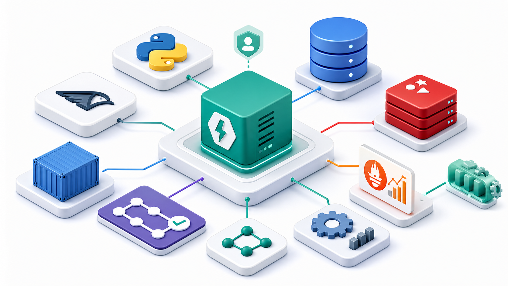
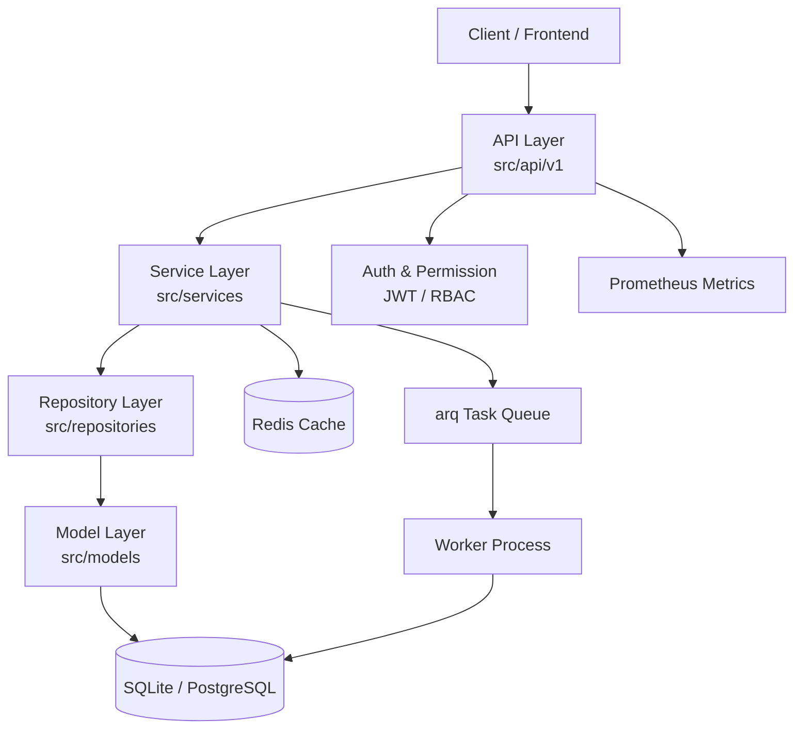

# FastAPI Template

<div align="center">


**5 分钟搭好企业级 FastAPI 后台 — 认证、RBAC、审计、文件、队列、Docker、CI 全部就绪。**

[English](README.en.md) | [在线文档](https://jiayuxu0.github.io/FastAPI-Template/) | [快速开始](#快速开始) | [核心特性](#核心特性) | [功能矩阵](#功能矩阵) | [贡献](#贡献)


[](https://github.com/JiayuXu0/FastAPI-Template/stargazers)
[](https://github.com/JiayuXu0/FastAPI-Template/forks)

</div>

---

## 目录

- [5 分钟快速体验](#5-分钟快速体验)
- [适合谁用](#适合谁用)
- [核心差异](#核心差异)
- [项目预览](#项目预览)
- [快速开始](#快速开始)
- [功能矩阵](#功能矩阵)
- [架构说明](#架构说明)
- [项目结构](#项目结构)
- [常用命令](#常用命令)
- [配置参考](#配置参考)
- [API 文档](#api-文档)
- [安全清单](#安全清单)
- [Roadmap](#roadmap)
- [贡献](#贡献)
- [Star History](#star-history)
- [License](#license)

---

## 5 分钟快速体验

用最小步骤看到完整效果：

```bash
git clone https://github.com/JiayuXu0/FastAPI-Template.git
cd FastAPI-Template
uv sync
cp .env.example .env
uv run aerich init-db
uv run uvicorn src:app --reload --host 0.0.0.0 --port 8000
```

打开 <http://localhost:8000/docs>，用默认账号登录：

```
username: admin
password: abcd1234
```

你将看到 **用户管理、角色管理、菜单管理、API 权限、部门管理、文件管理、审计日志** 的完整 Swagger 接口，开箱可用。

> 也可以用脚手架一行创建：`npx create-fastapi-app@latest my-backend` → [create-fastapi-app](https://github.com/JiayuXu0/create-fastapi-app)

---

## 适合谁用

| 适合 | 不适合 |
| --- | --- |
| 企业后台 / Admin API | 只想写一个极简单文件 demo |
| SaaS / 多团队权限系统 | 需要完整 React/Vue 前端模板 |
| 内部工具、运营平台、管理后台后端 | 需要微服务治理全家桶 |
| 权限、审计、文件、任务队列都要的服务 | 只需要一个无状态 HTTP 转发层 |
| 学习 FastAPI 分层架构和工程化实践 | 想完全从零手写每个基础模块 |

**具体场景：**

| 如果你需要 | 这里直接有 |
| --- | --- |
| 一个能直接开业务的后台 API 底座 | 用户、角色、菜单、API 权限、部门、文件、审计日志 |
| 一个结构清楚的 FastAPI 样板 | API → Service → Repository → Model 三层分离 |
| 一个带生产基础设施的模板 | Redis、PostgreSQL、Docker、Prometheus、Sentry、arq worker |
| 一个适合团队长期维护的起点 | UV、ruff、pytest、coverage、GitHub Actions、配置分层 |

---

## 核心差异

很多 FastAPI template 只解决"项目能跑起来"。这个模板更关注**业务开始后不会很快重写基础设施**。

| 维度 | 常见 demo / boilerplate | FastAPI Template |
| --- | --- | --- |
| 认证 | 登录接口和 access token | JWT access/refresh、限流、密码哈希、文档 Basic Auth |
| 权限 | 简单 role 字段 | 用户 → 角色 → 菜单/API，权限缓存和刷新机制 |
| 后台模块 | 需要自己补 CRUD | 用户、角色、菜单、部门、API、文件、审计日志开箱可用 |
| 架构 | 路由里混业务和 ORM | API、Service、Repository、Model 职责分离 |
| 运维 | 只有启动命令 | 健康检查、Prometheus 指标、trace id、结构化日志、Sentry |
| 异步任务 | 通常缺失 | arq + Redis worker、任务状态查询、定时任务示例 |
| 工程质量 | 测试和 CI 不完整 | ruff、pytest、coverage、pre-commit、GitHub Actions |

如果它帮你少写一套后台脚手架，欢迎点一个 Star。Star 越多，后续会优先补更多企业后台常见能力。

---

## 项目预览

<div align="center">

### 核心特性


### 技术栈



</div>

---

## 快速开始

### 方式一：脚手架创建

```bash
npx create-fastapi-app@latest my-backend
cd my-backend
uv run uvicorn src:app --reload --host 0.0.0.0 --port 8000
```

适合想快速生成新项目名、少改模板元信息的场景。脚手架项目：[create-fastapi-app](https://github.com/JiayuXu0/create-fastapi-app)

### 方式二：克隆模板

```bash
git clone https://github.com/JiayuXu0/FastAPI-Template.git
cd FastAPI-Template

uv sync
cp .env.example .env
uv run aerich init-db
uv run uvicorn src:app --reload --host 0.0.0.0 --port 8000
```

启动后可用入口：

| 入口 | 地址 |
| --- | --- |
| Swagger UI | <http://localhost:8000/docs> |
| ReDoc | <http://localhost:8000/redoc> |
| Health | <http://localhost:8000/api/v1/base/health> |
| Version | <http://localhost:8000/api/v1/base/version> |
| Metrics | <http://localhost:8000/api/v1/base/metrics> |

默认管理员：

```text
username: admin
password: abcd1234
```

> **重要**：首次启动后请立即修改默认密码，并在生产环境替换 `SECRET_KEY`、`SWAGGER_UI_PASSWORD` 和数据库密码。

### Docker Compose

```bash
cp .env.example .env
# 使用 compose 中的 PostgreSQL 时，将 .env 里的 DB_ENGINE 改为 postgres
docker compose up --build
```

Compose 会启动：

- `web`: FastAPI 应用
- `postgres`: PostgreSQL
- `redis`: 缓存与 arq 队列
- `worker`: arq 后台任务 worker

---

## 功能矩阵

### 认证与权限

| 功能 | 状态 | 说明 |
| --- | --- | --- |
| JWT 登录 | Done | access token + refresh token |
| 登录限流 | Done | 默认 5 次/分钟 |
| 刷新令牌限流 | Done | 默认 10 次/分钟 |
| RBAC | Done | 用户 → 角色 → API/菜单 |
| 超级管理员依赖 | Done | `SuperUserRequired` |
| API 文档保护 | Done | Swagger/ReDoc Basic Auth |

### 后台基础模块

| 模块 | API 前缀 | 说明 |
| --- | --- | --- |
| 用户管理 | `/api/v1/users` | 创建、更新、删除、查询、重置密码 |
| 角色管理 | `/api/v1/role` | 角色 CRUD、菜单/API 授权 |
| 菜单管理 | `/api/v1/menu` | 多级菜单配置 |
| API 权限 | `/api/v1/api` | API 权限表同步与管理 |
| 部门管理 | `/api/v1/dept` | 组织结构管理 |
| 文件管理 | `/api/v1/files` | 安全上传与文件映射 |
| 审计日志 | `/api/v1/auditlog` | 请求行为记录 |
| 任务队列 | `/api/v1/tasks` | arq job 状态查询 |

### 工程能力

| 能力 | 技术 | 说明 |
| --- | --- | --- |
| ORM | Tortoise ORM | async-first 数据访问 |
| 迁移 | Aerich | 版本化迁移 |
| 缓存 | Redis | TTL、空值保护、抖动、权限缓存失效 |
| 指标 | prometheus-client | `/api/v1/base/metrics` |
| 错误追踪 | Sentry | 配置 `SENTRY_DSN` 启用 |
| 队列 | arq | Redis-backed async jobs |
| 日志 | Loguru | JSON 结构化日志、request id |
| CI | GitHub Actions | lint、format、pytest、coverage、security scan |

---

## 架构说明



核心约定：

1. **路由保持薄**：只处理参数、依赖和响应。
2. **业务放 Service**：权限、校验、编排逻辑集中在服务层。
3. **数据访问走 Repository**：避免在 Service 里散落 ORM 查询。
4. **模型只描述数据结构**：Tortoise model 与 schema 分离。
5. **所有 I/O async-first**：数据库、缓存、任务队列都使用异步接口。

---

## 项目结构

```text
FastAPI-Template/
├── src/
│   ├── api/v1/              # API routes
│   │   ├── users/           # User APIs
│   │   ├── roles/           # Role APIs
│   │   ├── menus/           # Menu APIs
│   │   ├── tasks/           # arq job status APIs
│   │   └── ...
│   ├── services/            # Business logic
│   ├── repositories/        # Data access
│   ├── models/              # Tortoise ORM models
│   ├── schemas/             # Pydantic schemas
│   ├── core/                # Middlewares, metrics, dependencies
│   ├── tasks/               # arq worker, queue, jobs
│   ├── utils/               # Cache, JWT, password, helpers
│   └── settings/            # Runtime configuration
├── migrations/              # Aerich migrations
├── tests/                   # pytest test suite
├── docs/                    # MkDocs documentation
├── docker-compose.yml
├── Dockerfile
└── pyproject.toml
```

---

## 常用命令

### 开发

```bash
uv sync
uv run uvicorn src:app --reload --host 0.0.0.0 --port 8000
```

### 数据库

```bash
uv run aerich init-db
uv run aerich migrate --name "describe_change"
uv run aerich upgrade
uv run aerich history
```

### 测试与质量

```bash
uv run ruff check src/ tests/
uv run ruff format src/ tests/
uv run pytest
uv run pytest --cov=src --cov-report=html
```

### 后台任务

```bash
PYTHONPATH=src uv run arq tasks.worker.WorkerSettings
```

任务示例：

- `send_email_task`
- `cleanup_audit_logs_task`

---

## 配置参考

`.env.example` 已包含常用配置。生产环境至少检查这些项：

| 变量 | 建议 |
| --- | --- |
| `APP_ENV` | production |
| `DEBUG` | False |
| `SECRET_KEY` | `openssl rand -hex 32` 生成 |
| `SWAGGER_UI_PASSWORD` | 强密码 |
| `DB_ENGINE` | PostgreSQL 推荐 |
| `CORS_ORIGINS` | 写明确切域名 |
| `REDIS_URL` | 独立 Redis 实例 |
| `SENTRY_DSN` | 生产环境建议启用 |
| `METRICS_ALLOWED_IPS` | 仅开放给内网或监控系统 |

---

## API 文档

启动服务后：

- Swagger UI: <http://localhost:8000/docs>
- ReDoc: <http://localhost:8000/redoc>
- OpenAPI JSON: <http://localhost:8000/openapi.json>（受文档账号保护）

项目还包含 MkDocs 文档系统：

```bash
uv sync --group docs
uv run mkdocs serve
uv run mkdocs build
```

在线文档：[jiayuxu0.github.io/FastAPI-Template](https://jiayuxu0.github.io/FastAPI-Template/)

---

## 安全清单

- [ ] 修改默认管理员密码
- [ ] 生成强 `SECRET_KEY`
- [ ] 设置强 `SWAGGER_UI_PASSWORD`
- [ ] 生产环境关闭 `DEBUG`
- [ ] 使用 PostgreSQL 而不是 SQLite
- [ ] 配置精确 `CORS_ORIGINS`
- [ ] 使用 HTTPS
- [ ] 限制 `/metrics` 访问来源
- [ ] 配置日志采集与 Sentry
- [ ] 为文件上传设置合理大小和类型白名单

---

## Roadmap

- [x] 三层架构与 RBAC
- [x] 用户、角色、菜单、API、部门、文件、审计日志
- [x] JWT access/refresh token
- [x] Redis 缓存与权限缓存失效
- [x] Prometheus metrics、健康检查、trace id
- [x] Sentry 集成
- [x] arq 任务队列与 worker
- [x] Dockerfile + docker-compose
- [ ] 更完整的任务管理 UI/API
- [ ] 多租户隔离示例
- [ ] OpenTelemetry tracing
- [ ] 更高覆盖率的端到端测试

---

## 贡献

欢迎提交 Issue、Discussion 和 Pull Request。

```bash
git checkout -b feature/your-feature
uv run ruff check src/ tests/
uv run pytest
git commit -m "feat: add your feature"
```

更多说明：

- [贡献指南](CONTRIBUTING.md)
- [开发指南](CLAUDE.md)
- [Pre-commit Hooks 指南](docs/pre-commit-guide.md)

---

## Star History

如果这个项目帮你节省了搭建后台基础设施的时间，请给一个 Star。它会帮助更多 FastAPI 开发者发现这个模板。

<div align="center">

[](https://www.star-history.com/#JiayuXu0/FastAPI-Template&Date)

</div>

## License

[MIT](LICENSE)
